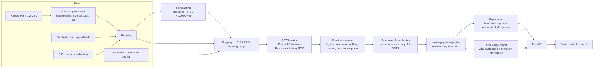

# GRIDTWIN — Renewable Distribution Grid Digital Twin (ENR-02)

**Build → Forecast → Stress → Detect → Heal → Verify.**

GRIDTWIN connects a medium-voltage feeder model to real, time-based solar data and synthetic consumer demand. It runs AC power flow every 15 minutes to find voltage and thermal violations, then tests corrective actions against the network limits. The actions are battery, feeder reconfiguration, inverter reactive power and *limited* curtailment, plus combinations of these. Every action is re-simulated before it is recommended. When nothing works, the app says so and reports the smallest intervention that would have been needed.

> **Physics decides, AI explains.** Every number in the UI comes from a pandapower AC power-flow result. "Action X works" means the modified network passed every constraint at every timestep. The optional LLM only rephrases text, and its numbers are checked against the simulation.

## What is real, what is synthetic, what is simulated

| Label | What it is |
|---|---|
| **REAL DATA** | Solar generation *shape* from Kaggle "Solar Power Generation Data", Plant 1, India: 15-min AC power from 22 inverters, 15 May–17 Jun 2020. It is scaled to the feeder's installed PV. |
| **SYNTHETIC DATA** | 8 deterministic consumer demand profiles (Bungalow … Office), the optional cloud event, and the clear-sky fallback profile (used only if the Kaggle files are missing). |
| **REPRESENTATIVE NETWORK** | The CIGRE MV benchmark feeder (CIGRE TF C6.04.02) from pandapower. It is **not a real Indian feeder**. We added four sectionalizing switches so that reconfiguration has alternatives. |
| **SIMULATED RESULTS** | Every voltage, loading, loss, SOC and feasibility verdict. |
| **UPLOADED · UNVERIFIED** | Any CSV a user uploads. |

The header of every page shows these labels.

## Architecture



More detail is in [docs/architecture.md](docs/architecture.md).

## The digital twin and power flow

- **Network:** `pandapower.networks.create_cigre_network_mv(with_der="pv_wind")`, pandapower 3.5.5. It has 15 buses (a 110 kV slack bus and 20 kV buses 1–14), two 25 MVA transformers, two feeders and three tie switches, plus our four sectionalizers. The 7 switchable switches give 128 combinations; **17 are radial and fully energised**.
- **Time:** quasi-static time series (QSTS) with 15-min steps. Each step runs a full AC Newton-Raphson power flow, and battery SOC carries over between steps (η_c = η_d = √0.92, SOC limited to 10–90 %).
- **Constraints:** V 0.95–1.05 pu, line and transformer loading ≤ 100 %, curtailment ≤ 20 % per step, losses > 8 % flagged as a WARNING, reverse flow reported as INFO (or treated as a violation if a limit is set), plus ISLANDED_BUS and NON_CONVERGENCE. Severity comes from the size of the margin.
- **Hosting capacity:** per-bus bisection on added PV under the window's worst case (maximum PV step with minimum load step).

Details, physics and calibration: [docs/simulation.md](docs/simulation.md).

## Corrective actions and optimisation

| Action | How it is sized |
|---|---|
| A1 Battery | Per violated step, bisection for the *minimum* charge (surplus) or discharge (deficit) within p_max and SOC headroom. SOC saturation is reported. |
| A2 Reconfiguration | All 128 switch states are enumerated. Islanded or meshed configurations are rejected, radial ones are screened with real power flows, and the best is verified over the whole window. Switch operations are counted. |
| A3 Reactive | PV inverters absorb or inject Q within min(√(S²−P²), P·tan φ_min), PF ≥ 0.90. Bisection finds the minimum Q. Saturation is reported. |
| A4 Limited curtailment | Uniform, found by bisection, capped at 20 %. The *required* value is always reported, even when it exceeds the cap. |
| A5 Combinations | Battery+curtail, reactive+curtail, switching+battery, and all levers. The order is always switching → battery → reactive → curtail only the residual. |

Objective: **feasible first**, then minimise J = 10·E_curtailed + 1·E_battery + 2·N_switch + 1·E_losses + 0.2·E_reactive. The weights can be changed and re-rank candidates without re-simulating. See [docs/optimization.md](docs/optimization.md).

## Forecasting and predictive operation

- **Generation forecast:** three baselines (persistence of the same time yesterday, last value, 1 h mean) and a scikit-learn `HistGradientBoostingRegressor` with quantile loss giving P10/P50/P90. The model forecasts directly for each horizon, 1–8 steps ahead.
- **Backtest:** time-ordered split, scored on daylight steps only. HGB P50 MAE is **0.093 pu**, against **0.126 pu** for the best baseline (same time yesterday). P10–P90 coverage is **78 %** (nominal 80 %). This is only indicative: ~34 days from one plant in one season.
- **Predictive mode:** forecast the next 2 h → run the twin on P50 and P90 → plan on the forecast → freeze the plan → **replay it on actual data** → `PLAN_HELD` or `PLAN_FAILED_ON_ACTUALS`.
- **Demand:** not ML-forecast. The profiles are deterministic, so ML metrics on them would be meaningless. Predictive mode adds a configurable demand error instead.

See [docs/forecasting.md](docs/forecasting.md).

## Scenario library (outcome classes asserted by acceptance tests)

| ID | Scenario | Outcome (computed) |
|---|---|---|
| S1 | Normal solar + Residential Society | SAFE, no action needed |
| S2 | Solar surge, battery available | Violation → **battery** recommended, 0 % curtailment |
| S3 | Surge, battery unavailable | Violation → switching / reactive / curtailment compared; reconfiguration feasible |
| S4 | Solar + Small Factory | SAFE |
| S5 | Evening spike, battery depleted | Undervoltage + overload; curtailment N/A; **no feasible solution**; 3.09 MW load reduction reported |
| S6 | Extreme surplus, battery full, 20 % cap | **NO FEASIBLE SOLUTION UNDER CURRENT CONSTRAINTS**; 35.9 % curtailment required vs the 20 % cap |
| S7 | Cloud event, plan made on forecast | **PLAN_FAILED_ON_ACTUALS**: the cloud depresses the forecast and sun returns |
| S8 | Plan safe on P50, violates on P90 | P50 SAFE, P90 VIOLATION, so robust planning matters |

Parameters are set relative to thresholds from `make calibrate` (see `simulation/calibration.json`). Results are always computed, never stored.

## Install (macOS)

Requires Python 3.11 (3.10–3.12 works) and Node 20+.

```bash
make setup          # venv at backend/.venv, pinned requirements, npm install
```

Place the Kaggle files in `data/raw/solar_kaggle/`:
`Plant_1_Generation_Data.csv`, `Plant_1_Weather_Sensor_Data.csv`, `Plant_2_Generation_Data.csv`, `Plant_2_Weather_Sensor_Data.csv`.
**If they are missing, the app still runs** on a clearly labelled SYNTHETIC clear-sky profile, and the backend prints a warning.

Optional LLM features: `pip install anthropic` inside the venv and `export ANTHROPIC_API_KEY=...`. Without these, the rule-based parser and template explanations are used.

## Run

```bash
make dev                  # backend :8000 + frontend :5173
make dev PORT=8010        # if port 8000 is taken
```

- UI: http://localhost:5173
- API docs (OpenAPI): http://localhost:8000/docs

## Tests and checks

```bash
make test         # 90 backend tests (unit, integration, acceptance S1–S8) + 4 frontend component tests
make demo-check   # the 22-step final demo through the API, printed as a PASS/FAIL table (in-process, temp DB)
make calibrate    # regenerate simulation/calibration.json (~80 s)
```

## API summary

`GET /api/health` · `GET /api/config/constraints` · `GET /api/networks[/{id}]` · `GET /api/datasets` · `POST /api/datasets/upload` · `GET /api/datasets/{id}/series` · `GET /api/load-profiles[/{type}/series]` · `POST /api/scenarios/build` · `GET /api/scenarios/library[/{id}]` · `POST /api/simulate/run` · `POST /api/simulate/snapshot` · `GET /api/simulate/latency` · `POST /api/actions/evaluate` · `POST /api/actions/apply` · `GET|POST /api/hosting-capacity` · `GET /api/forecast/backtest` · `POST /api/forecast/predictive` · `POST /api/whatif/parse` · `POST /api/whatif/run` · `POST|GET /api/history` · `GET /api/history/{id}` · `GET /api/history/compare?a&b`.

Errors always have the shape `{"error_code","message","details"}`, and stack traces never reach the client. See [docs/api.md](docs/api.md).

## Pages

**PLAY (landing page):** an isometric city-builder view of the feeder. Buildings sit at the real buses and wires follow the real topology. Wire and ground colours come from the simulated loading and voltage, and particles move in the simulated power-flow direction (faster = more MW). It has NORMAL / SURGE / EXTREME scenario buttons, a 5-segment grid-health bar (score computed in the backend), an operator log, and four action buttons plus AUTO-FIX. Each button re-simulates the whole window and shows a GRID STABILIZED / NOT ENOUGH / NO FEASIBLE SOLUTION banner with the backend's reason. Motion respects `prefers-reduced-motion`.

**Light and dark mode:** use the ☀/☾ toggle in the header. It defaults to the OS setting and the choice is remembered per browser. Light mode has its own selected palette rather than an automatic inversion: a cream UI and a green board, with the near-black outlines kept, and status and text colours darkened for contrast. Chart colours are limited to three hues (blue, solar yellow, aqua) plus grey. That set passes the colour-blind and normal-vision separation checks in both themes.

**ENGINEER VIEW:** Scenario Builder · Grid Twin (single-line diagram, time scrubber, inspector, charts) · Live Lab (debounced sliders, ~40–100 ms per power-flow snapshot) · Heal & Verify (all candidates, weights, apply → before/after, infeasible panel, save) · Forecast & Predict · What-If (natural language → editable parameter chips) · Library (datasets, upload, saved scenarios and comparison, hosting-capacity map).

Demo script: [docs/demo.md](docs/demo.md). Q&A: [docs/judge_qa.md](docs/judge_qa.md), [docs/viva_qa.md](docs/viva_qa.md).

## Limitations

- **Balanced, positive-sequence power flow.** Real LV/MV feeders have unbalanced single-phase PV. CIGRE MV is a balanced benchmark, so this is consistent for this network, but it cannot show phase imbalance.
- **Representative network.** CIGRE MV parameters, not a DISCOM feeder. Buses 1 and 12 carry ~20 MW of aggregated substation load, which masks reverse flow at the transformers. We therefore also watch the feeder-head lines.
- **Data.** A 34-day, single-season, single-plant solar record. Demand is synthetic. Forecast metrics are indicative.
- **Loads are constant-power** with a fixed PF of 0.95. There is no OLTC or capacitor-bank control (the CIGRE transformers have no tap model), and wind is held at 0 MW.
- **Controls.** Battery and reactive control are per-step "minimum needed" heuristics verified by power flow, not a multi-period optimal power flow. So a battery can saturate early where look-ahead scheduling would have saved headroom. S7/S8 show this honestly.
- **Speed.** A full evaluation takes 5–9 s (9 candidates in parallel processes); Live Lab snapshots take ~40–100 ms.

## Future work

Unbalanced three-phase power flow (e.g. OpenDSS) on a real feeder; OLTC and capacitor control; multi-period OPF / MPC battery scheduling with look-ahead; forecasts from real demand data through `LoadDatasetAdapter`; probabilistic (P90-robust) planning as a selectable policy; weather-API irradiance forecasts; multi-feeder studies.
